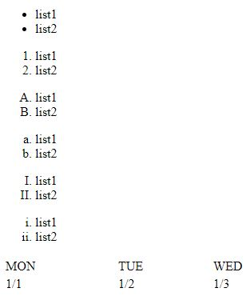
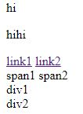

# html 學習紀錄
<!--more-->
## 基本架構
```html
<!DOCTYPE html>
<html>
    <head>
        <!--下面是網頁的資訊-->
        <meta charset="UTF-8" />
        <title> 饅頭的網頁 </title>
    </head>

    <body>
    </body>
</html>
```
- `<!DOCTYPE html>` 表示文件類型是html
- `<!---->`是註解
- 一開始先寫`<html></html>`
  - `<html>` 代表開始，`</html>` 是結束標籤
  - 一般內容會由主要標籤跟結束標籤包起來
- `<head>` 是放網頁的資訊
- `<meta>` 是放網頁的資訊，不過比要偏向是提供給搜尋引擎的資料，有許多元資料的屬性
- `<body>` 是放網頁的內容
- `<!---->` 是註解
  
## 查看網頁的html程式碼
- 按F12就可以看網頁的html程式碼
- 將鼠標移到該物件上面按右鍵點選檢查
## 基本標籤
```html
    <body>
        <!--標籤-->
        <h1>post1(h1)</h1>
        <h2>post2(h2)</h2>
        <p>這是段落</p>   
        <br />
        <i>這是斜體</i>
        <br />
        <b>這是粗體</b>
        <br />
        <i><b>這是斜體加粗體</b></i>
        <br />
        <b><i>這是斜體加粗體</i></b>
        <br />
        <b>"br/"</b> 是換行，不用關閉標籤
    </body>
```
- 標題的標籤重**h1**到**h6**，h1最大，h6最小
- `,p.` 是段落
- `<br />` 是換行，由於中間不會有內容，所以不用關閉標籤
- `<i>` 是斜體
- `<b>` 是粗體
- `<hr />` 是水平線，同樣也不用關閉標籤
- 上面的程式碼的呈現結果如下  
  


## 連結 & 圖片
```html
<!--連結外部網頁-->
<a href="https://www.youtube.com/watch?v=CLUPkcLQm64">小白的教學連結</a>
<!--連結同個目錄下的網頁-->
<a href="page1.html">page1</a>
<!--連結不同目錄下的網頁-->
<a href="dir/page2.html">dir 下的 page2</a>
```
```html
<!--網路上的圖片-->

<!--本地圖片-->


```
- `<a>` 標籤是用來建立超連結
- `` 也同樣不用關閉標籤
  - 引入圖片，在src後面放本地路徑或圖片網址即可
  - 後面可調整長寬，若是只有指定其中一項，則會等比例調整

## 影片 & 嵌入 youtube 影片
```html
<!--本地影片-->
<video src="video.mp4" controls width="450">瀏覽器無法載入影片</video>
<!--瀏覽器無法載入影片時會顯示被包起來的文字-->

<iframe width="560" height="315" src="https://www.youtube.com/embed/lPmOB_nfQMU" title="YouTube video player" frameborder="0" allow="accelerometer; autoplay; clipboard-write; encrypted-media; gyroscope; picture-in-picture"
allowfullscreen></iframe>
```
- 引入本地的影片
  - 同樣也是在src之後接上路徑即可
  - 調整長寬使用 `controls width ,height`
- 嵌入youtube 影片
  1. 選定一個影片，點選分享
  2. 點選嵌入
  3. 複製該段程式碼至你想要嵌入的位置
## 列表 & 表格
```html
    <!--列表-->
    <hr />
    <ul>
      <li>list1</li>
      <li>list2</li>
    </ul>
    <!--順序性列表，預設用數字排序-->
    <ol>
      <li>list1</li>
      <li>list2</li>
    </ol>
    <!--從A開始排序-->
    <ol type="A">
      <li>list1</li>
      <li>list2</li>
    </ol>
    <!--從a開始排序-->
    <ol type="a">
      <li>list1</li>
      <li>list2</li>
    </ol>
    <!--用大寫羅馬數字排序-->
    <ol type="I">
      <li>list1</li>
      <li>list2</li>
    </ol>
    <!--用小寫羅馬數字排序-->
    <ol type="i">
      <li>list1</li>
      <li>list2</li>
    </ol>
```
```html
    <!--表格-->
    <table width="400">
      <tr>
        <td>MON</td>
        <td>TUE</td>
        <td>WED</td>
      </tr>
      <tr>
        <td>1/1</td>
        <td>1/2</td>
        <td>1/3</td>
      </tr>
    </table>
```
- 列表
  - `<ul>` 是一般列表
  - `<ol>` 是有排序的列表，用`type` 指定排序樣式
  - 裡面每一項用`<li>`包起來
- `<table>` 是表格
  - `<tr>` 包住一個row
  - `<td>` 包住一個item
- 以上程式碼呈現如下  



## 容器 div & span
```html
    <div style="color: blue">
      <ul>
        <li>list1</li>
        <li>list2</li>
      </ul>
      <ol>
        <li>list1</li>
        <li>list2</li>
      </ol>
    </div>
    <p>hi</p>
    <p>hihi</p>
    <a href="#">link1</a>
    <a href="#">link2</a>
    <br />
    <span>span1</span>
    <span>span2</span>
    <div>div1</div>
    <div>div2</div>
```
- 以上程式碼呈現如下  



## meta
```html
<meta charset="UTF-8" />
<meta name="discription" content="html的學習紀錄"/>
<meta name="author" content="饅頭"/>
<meta name="keyword" content="饅頭,html,教學"/>
<meta name="viewport" content="width=device-width, initial-scale=1.0"/>
  ```
  ## 輸入
  ``` html
<input type="text" placeholder="請輸入帳號" />
<input type="password" placeholder="請輸入密碼" />
<input type="date"/>
<input type="range">
<input type="file">
<input type="checkbox">
<input type="radio">
<input type="color">
<input type="submit">
<textarea>textarea</textarea>
  ```